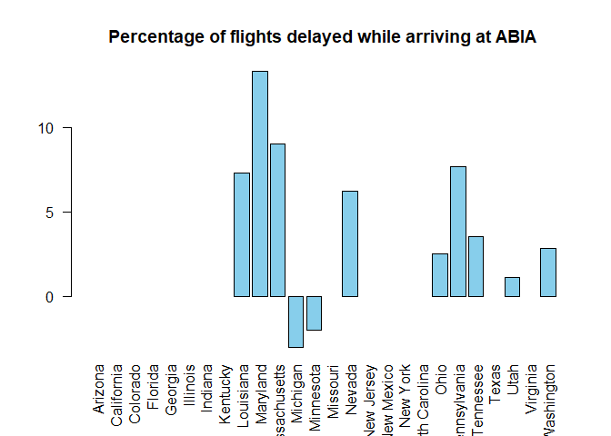
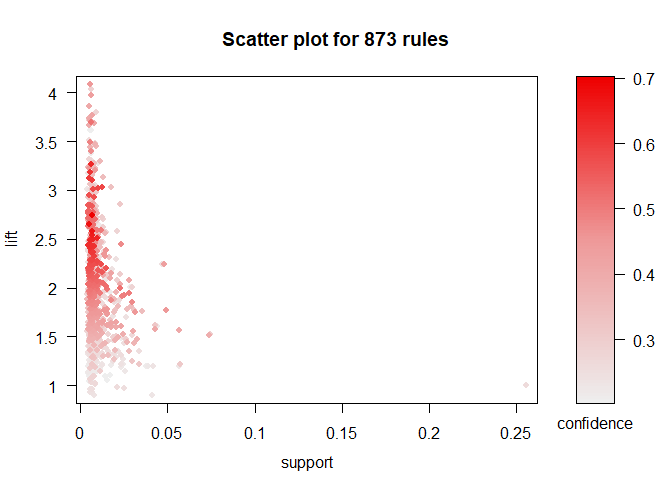

Exercise 2
================
Abhinaya Ananthakrishnan, Jui Gupta, Sherlley Loo, Teeru Gupta
August 17, 2018

Question 1
==========

Analysis details:
-----------------

Austin has one of the busiest airports in the city mainly driven by students attending UT Austin. We believe that we can generate some valuable insights to students starting school along with their parents, friends and relatives visiting this wonderful city.

For a comfortable journey, we feel the following information is crucial:

1.  Which are the busiest months?
2.  Which is the busiest day?
3.  Where is busiest route?
4.  Which flight carrier should one avoid?

``` r
set.seed(145)
df = read.csv("data/ABIA.csv")

df = df %>%
  mutate_at(c(25:29), funs(replace(.,is.na(.),0))) %>%
  mutate_at(15, funs(replace(.,is.na(.),0))) %>%
  mutate ("Flight" = paste(UniqueCarrier,FlightNum) ) %>%
  mutate("Late Arrival" = ifelse(ArrDelay > 0 , 1, 0)) %>%
  mutate("Late Carrier" = ifelse(CarrierDelay > 0,1, 0)) %>%
  mutate("Late Aircraft" = ifelse(LateAircraftDelay > 0, 1, 0)) %>%
  mutate("OpEff" = `Late Arrival` + `Late Carrier` + `Late Aircraft` + Cancelled)
```

### Which are the busiest months at ABIA?

``` r
ggplot(df, aes(x= factor(Month))) +geom_bar(stat = "count") + labs(x = "Month", y= "Number of flights", title = "Number of flights in the year 2008") +coord_flip()
```


As expected, we observe that May to August is a busy time given graduation, vacations and back to school.

We will further analyze this data to check our hypotheses.

``` r
df = df%>%
  filter(Month == 5 | Month == 6| Month ==7 | Month ==8)
```

### Which route has the most delays?

During this period, a higher percentage of flights are delayed while departing from Austin as compared to arriving from Austin.

From the following plots, we can observe that flights from **Austin -&gt; Virginia** suffer the highest delay times.

``` r
origin = df_origin %>%
  mutate_at(15, funs(replace(.,is.na(.),0))) %>%
  group_by(AIRPORT_STATE_NAME.dest) %>%
  summarize(flights = mean(DepDelay))
barplot(origin$flights, names.arg = origin$AIRPORT_STATE_NAME.dest,axisnames = TRUE, las=2, col="skyblue", main = "Percentage of flights delayed while arriving at ABIA")
```



``` r
destination = df_dest %>%
  group_by(AIRPORT_STATE_NAME.org) %>%
  summarize(flights = mean(ArrDelay))
barplot(destination$flights, names.arg = destination$AIRPORT_STATE_NAME.org,axisnames = TRUE, las=2, col="skyblue", main = "Percentage of flights while departing from ABIA")
```


``` r
data("fifty_states") # this line is optional due to lazy data loading
q <- ggplot(us_states_flight_dest, aes(map_id = region)) + 
  # map points to the fifty_states shape data
  geom_map(aes(fill = flights), map = fifty_states) + 
  expand_limits(x = fifty_states$long, y = fifty_states$lat) +
  coord_map() +
  scale_x_continuous(breaks = NULL) + 
  scale_y_continuous(breaks = NULL) +
  labs(x = "", y = "") +
  theme(legend.position = "bottom", 
        panel.background = element_blank()) +
  labs(title ="Flights departing from Austin to other cities")
q
```


### Which carriers should one avoid?

To analyze which carriers to avoid, we calculated the operational efficieny of the carriers. The operational efficiency was calculated as the weighted average of the following variables:

1.  Cancelled Flights
2.  Delayed Arrivals
3.  Late Aircrafts
4.  Delays due to the carrier

The following graph compares the operational efficiency across the various carriers that operate out of ABIA. The operational efficiency is inversely proportional to the performance of the carrier i.e the lower the operational efficiency, better the performance of the carrier.

``` r
ops = df %>%
  group_by(UniqueCarrier, OpEff) %>%
  summarise( cn = n()) %>%
  mutate(performance = weighted.mean(cn,OpEff))

cls = c(1,4)
perfid = unique(ops[,cls])

ggplot(perfid, aes(x = UniqueCarrier , y = performance)) + geom_bar(stat = "identity", fill = "#0000CC") + labs(title = "Operational Delays of Carriers in 2008", x = "Carriers", y="Operational Delays")
```


### Is there a day of the week that should be avoided?

The following graphs exhibit that **Wednesday** is the best day to travel with minimal arrival and departure delays.

``` r
#busiset day
arr = df %>%
  group_by(DayOfWeek) %>%
  summarise(arr_delay = mean(ArrDelay))
  
dep = df %>%
  mutate_at(18, funs(replace(.,is.na(.),0))) %>%
  group_by(DayOfWeek) %>%
  summarise(dep_delay = mean(DepDelay))

par(mfrow=c(1,2))
ggplot(arr,aes(x=DayOfWeek, y = arr_delay)) + geom_line() + geom_point()+ labs(title = "Arrival delays of flights per day in May - Aug 2008", x = "Day of week",y="Mean of arrival delays")
```


``` r
ggplot(dep,aes(x=DayOfWeek, y = dep_delay)) + geom_line() + geom_point()+ labs(title = "Departure delays of flights per day in May - Aug 2008", x = "Day of week",y="Mean of departure delays") 
```


Conclusion
----------

If you're looking travel to Austin to attend your kid's graduation or heading back to school, we strongly advise (in the months of May to Aug):

1.  Travel by NW airline carrier
2.  On a Wednesday
3.  And avoid flying to Virginia, New York and North Carolina

Question 2
==========

Predict the author of the article based on article's textual context

Step 1: Reading in the files from C50train and C50test directories
------------------------------------------------------------------

``` r
library(tm)
```

    ## Loading required package: NLP

    ## 
    ## Attaching package: 'NLP'

    ## The following object is masked from 'package:ggplot2':
    ## 
    ##     annotate

``` r
#Wrapper function
readerPlain = function(fname){
  readPlain(elem=list(content=readLines(fname)), 
            id=fname, language='en') }

author_dirs_train = Sys.glob('ReutersC50/C50train/*')
author_dirs_test = Sys.glob('ReutersC50/C50test/*')
```

We have imported all the authors files for training into `author_dirs_train`. Now we will clean these files.

``` r
# Rolling all directories together into a single corpus and getting Author names
file_list_train = NULL
labels = NULL
for(author in author_dirs_train) 
{
  author_name = substring(author, first = 29)
  files_to_add = Sys.glob(paste0(author, '/*.txt'))
  file_list_train = append(file_list_train, files_to_add)
  labels = append(labels, rep(author_name, length(files_to_add)))
}

#Getting rid of '.txt' from filename
all_docs_train = lapply(file_list_train, readerPlain) 
names(all_docs_train) = file_list_train
names(all_docs_train) = sub('.txt', '', names(all_docs_train))


file_list_test = NULL
labels = NULL
for(author in author_dirs_test) 
{
  author_name = substring(author, first = 29)
  files_to_add = Sys.glob(paste0(author, '/*.txt'))
  file_list_test = append(file_list_test, files_to_add)
  labels = append(labels, rep(author_name, length(files_to_add)))
}

#Getting rid of '.txt' from filename
all_docs_test = lapply(file_list_test, readerPlain) 
names(all_docs_test) = file_list_test
names(all_docs_test) = sub('.txt', '', names(all_docs_test))
```

`all_docs_train` has all the files. `author_name` has the name of the authors who wrote the corresponding files. `file_list_train` has the full path of all the files.

Step 2: Creating the Document Term Matrix and TF-IDF for training
-----------------------------------------------------------------

``` r
# Creating training corpus and processing
my_corpus_train = Corpus(VectorSource(all_docs_train))
#names(my_corpus_train) = sapply(strsplit(names(all_docs_train), "/"), "[", 3)

# Preprocessing
my_corpus_train = tm_map(my_corpus_train, content_transformer(tolower)) # make everything lowercase
my_corpus_train = tm_map(my_corpus_train, content_transformer(removeNumbers)) # remove numbers
my_corpus_train = tm_map(my_corpus_train, content_transformer(removePunctuation)) # remove punctuation
my_corpus_train = tm_map(my_corpus_train, content_transformer(stripWhitespace)) ## remove excess white-space
my_corpus_train = tm_map(my_corpus_train, content_transformer(removeWords), stopwords("SMART"))
my_corpus_train = tm_map(my_corpus_train, content_transformer(removeWords), stopwords("en"))

DTM_train= DocumentTermMatrix(my_corpus_train)

DTM_train# some basic summary statistics

DTM_train = removeSparseTerms(DTM_train, 0.95)
DTM_train # now ~ 660 terms (versus ~32000 before)
tfidf_train = weightTfIdf(DTM_train)
```

Step 3: Creating the Document Term Matrix and TF-IDF for testing
----------------------------------------------------------------

NOTE: The words which aren't present in the training data are dropped here from the test DTM.

``` r
my_corpus_test = Corpus(VectorSource(all_docs_test))
#names(my_corpus_test) = sapply(strsplit(names(all_docs_test), "/"), "[", 3)

# Preprocessing
my_corpus_test = tm_map(my_corpus_test, content_transformer(tolower)) # make everything lowercase
my_corpus_test = tm_map(my_corpus_test, content_transformer(removeNumbers)) # remove numbers
my_corpus_test = tm_map(my_corpus_test, content_transformer(removePunctuation)) # remove punctuation
my_corpus_test = tm_map(my_corpus_test, content_transformer(stripWhitespace)) ## remove excess white-space
my_corpus_test = tm_map(my_corpus_test, content_transformer(removeWords), stopwords("SMART"))
my_corpus_test = tm_map(my_corpus_test, content_transformer(removeWords), stopwords("en"))

DTM_test= DocumentTermMatrix(my_corpus_test,control = list(dictionary=Terms(DTM_train)))

DTM_test# has the same 660 terms
tfidf_test = weightTfIdf(DTM_test)
```

Step 4: Summarizing the Term matrices by using PCA
--------------------------------------------------

``` r
tfidf_train_df <- as.data.frame(as.matrix(tfidf_train))
tfidf_test_df <- as.data.frame(as.matrix(tfidf_test))

# PCA on the TF-IDF weights
pc_author = prcomp(tfidf_train_df)
pc_author_test <- predict(pc_author, newdata = tfidf_test_df)
pc_author_test <- as.data.frame(pc_author_test)

pve = summary(pc_author)$importance[3,]
plot(pve)
```


Since we cant see much of an elbow, we will cut at 75.

Step 5: Exploring Classification Models
---------------------------------------

### Model 1: Boosting

``` r
library(gbm)
#mode("X") = "numeric"
set.seed(12345)

n_cut = 75
X = pc_author$x[,1:n_cut]
y = sapply(strsplit(names(all_docs_train), "/"), "[", 3)
X_test = pc_author_test[,1:n_cut]
y_test = sapply(strsplit(names(all_docs_test), "/"), "[", 3)

TrainSet <- cbind(as.data.frame(X),y)
ValidSet <- cbind(as.data.frame(X_test),y_test)

boost.author <- gbm(y ~.,data=TrainSet, n.trees =100 ,shrinkage = 0.01,distribution = "multinomial",interaction.depth=4, cv.folds = 5)

#== checking accuracy on trainset
pred=as.data.frame(predict(boost.author,newdata =TrainSet,n.trees=100,type="response"))
pred_val = sub("*\\.[0-9]+", "", colnames(pred)[apply(pred,1,which.max)])
mean(pred_val== y )
```

    ## [1] 0.8576

``` r
#== checking accuracy on test data
pred=as.data.frame(predict(boost.author,newdata =ValidSet,n.trees=100,type="response"))
pred_val = sub("*\\.[0-9]+", "", colnames(pred)[apply(pred,1,which.max)])
mean(pred_val== y )
```

    ## [1] 0.39

Boosting classifies the training data well, but is unable to classify the test data.

### Model 2: Random Forest

``` r
library(randomForest)
set.seed(12345)
n_cut = 150
X = pc_author$x[,1:n_cut]
y = sapply(strsplit(names(all_docs_train), "/"), "[", 3)
X_test = pc_author_test[,1:n_cut]
y_test = sapply(strsplit(names(all_docs_test), "/"), "[", 3)

TrainSet <- cbind(as.data.frame(X),y)
ValidSet <- cbind(as.data.frame(X_test),y_test)

rffit <- randomForest(y~.,TrainSet,ntree=200)
mean(predict(rffit,TrainSet)== y )
```

    ## [1] 1

``` r
mean(predict(rffit,ValidSet)== y )
```

    ## [1] 0.502

Random Forest does a better job than classification as compared to Boosting.

Model 3: Naive Bayes
--------------------

To avoid combinatorial explosion, we will have to build 1 classifier per author and then take the average accuracy for all authors. More details on combinatorial explosion here (<https://stackoverflow.com/questions/36323759/multiclass-classification-with-naive-bayes-and-r>)

Comparing the probability scores across the whole dataset and choosing the class based on highest probability. More on (<https://stats.stackexchange.com/questions/142505/how-to-use-naive-bayes-for-multi-class-problems>)

``` r
library(foreach)
library(doParallel)
library(data.table)
set.seed(12345)
registerDoParallel()

author_names = unique(sapply(strsplit(names(all_docs_train), "/"), "[", 3))
author_names_train = sapply(strsplit(names(all_docs_train), "/"), "[", 3)
author_names_test = sapply(strsplit(names(all_docs_test), "/"), "[", 3)
D = ncol(tfidf_train_df)

#initializing a matrix to store the output of 50 Naive Bayes models
NB_MODEL = matrix(0,2500,50)
NB_MODEL_train = matrix(0,2500,50)
NB_error_rate = matrix(0,50)

#creating training and testing data
X_train = data.table(tfidf_train_df + 1/D)
X_test  = data.table(tfidf_test_df + 1/D)

#Training Naive Bayes classifier for all models
#Using matrix multiplication for faster calculation

for (i in 1:50){
  y_train = 0+{author_names_train == author_names[i]}
  pvec_1 = colSums(X_train[y_train==1,])
  pvec_1 = pvec_1/sum(pvec_1)
  
  #Runing classsifier on training data
  log_1 = as.matrix(X_train ) %*% as.matrix(log(pvec_1))
  NB_MODEL_train[,i] = log_1
  
  #Running the classifier on test data
  log_1 = as.matrix(X_test) %*% as.matrix(log(pvec_1))
  NB_MODEL[,i] = log_1
}

#Training data accuracy
x = apply(NB_MODEL_train, MARGIN = 1, FUN = which.max)
pred_author_train = author_names[x]
mean(pred_author_train == author_names_train)
```

    ## [1] 0.9032

``` r
#Testing data accuracy
x = apply(NB_MODEL,MARGIN = 1, FUN = which.max)
pred_author_test = author_names[x]
mean(pred_author_test == author_names_test)
```

    ## [1] 0.0328

Model Comparison and Conclusion
-------------------------------

|                    | XG Boost | Random Forest | Naive Bayes |
|--------------------|----------|---------------|-------------|
| Baseline Accuracy  | 85.7 %   | 100%          | 90.3%       |
| Test Accuracy      | 39.0%    | 50.3%         | 3.2%        |
| Computational Time | Long     | Medium        | Short       |

Random Forest takes some time to compute, however, classifies the documents with the highest accuracy.

Dropping words from the test dictionary (DTM) that do not belong to the training dictionary may be the driving factor for lower accuracy scores from advanced algorithms like Random Forest and Boosting.

We also observed that Multiclass Lasso Regression and Ridge Regression failed to converge, primarily because of the non-linearity in the data

Question 3
==========

`groceries.txt` consits of items that are purchased in one basket in a grocery store. By summarizing the transactions, we can observe that the most frequently purchased item was "whole milk" followed by "other vegetables" and "rolls/buns".

By using this data, we want to recommend to the store manager:

-   The item bundles to run promotions on
-   Placement of items on aisles

``` r
library(tidyverse)
library(arules)  
library(arulesViz)
library(stringr)
set.seed(12345)

groceries <- read.transactions("data/groceries.txt", format = "basket", sep = ",",
                  cols = NULL, rm.duplicates = FALSE, 
                  quote = "\"'", skip = 0, 
                  encoding = "unknown")

groctrans = as(groceries, "transactions")
summary(groctrans)
```

    ## transactions as itemMatrix in sparse format with
    ##  9835 rows (elements/itemsets/transactions) and
    ##  169 columns (items) and a density of 0.02609146 
    ## 
    ## most frequent items:
    ##       whole milk other vegetables       rolls/buns             soda 
    ##             2513             1903             1809             1715 
    ##           yogurt          (Other) 
    ##             1372            34055 
    ## 
    ## element (itemset/transaction) length distribution:
    ## sizes
    ##    1    2    3    4    5    6    7    8    9   10   11   12   13   14   15 
    ## 2159 1643 1299 1005  855  645  545  438  350  246  182  117   78   77   55 
    ##   16   17   18   19   20   21   22   23   24   26   27   28   29   32 
    ##   46   29   14   14    9   11    4    6    1    1    1    1    3    1 
    ## 
    ##    Min. 1st Qu.  Median    Mean 3rd Qu.    Max. 
    ##   1.000   2.000   3.000   4.409   6.000  32.000 
    ## 
    ## includes extended item information - examples:
    ##             labels
    ## 1 abrasive cleaner
    ## 2 artif. sweetener
    ## 3   baby cosmetics

Creating premlinary rules
-------------------------

As expected, we observe that almost every customer purchases "whole milk" with every other item in the basket.

``` r
# Now run the 'apriori' algorithm
grocrules = apriori(groctrans, 
    parameter=list(support=.005, confidence=.2, maxlen=5))
```

    ## Apriori
    ## 
    ## Parameter specification:
    ##  confidence minval smax arem  aval originalSupport maxtime support minlen
    ##         0.2    0.1    1 none FALSE            TRUE       5   0.005      1
    ##  maxlen target   ext
    ##       5  rules FALSE
    ## 
    ## Algorithmic control:
    ##  filter tree heap memopt load sort verbose
    ##     0.1 TRUE TRUE  FALSE TRUE    2    TRUE
    ## 
    ## Absolute minimum support count: 49 
    ## 
    ## set item appearances ...[0 item(s)] done [0.00s].
    ## set transactions ...[169 item(s), 9835 transaction(s)] done [0.00s].
    ## sorting and recoding items ... [120 item(s)] done [0.00s].
    ## creating transaction tree ... done [0.00s].
    ## checking subsets of size 1 2 3 4 done [0.00s].
    ## writing ... [873 rule(s)] done [0.00s].
    ## creating S4 object  ... done [0.00s].

``` r
inspect(grocrules[1:10])
```

    ##      lhs              rhs                support     confidence lift     
    ## [1]  {}            => {whole milk}       0.255516014 0.2555160  1.0000000
    ## [2]  {cake bar}    => {whole milk}       0.005592272 0.4230769  1.6557746
    ## [3]  {dishes}      => {other vegetables} 0.005998983 0.3410405  1.7625502
    ## [4]  {dishes}      => {whole milk}       0.005287239 0.3005780  1.1763569
    ## [5]  {mustard}     => {whole milk}       0.005185562 0.4322034  1.6914924
    ## [6]  {pot plants}  => {whole milk}       0.006914082 0.4000000  1.5654596
    ## [7]  {chewing gum} => {soda}             0.005388917 0.2560386  1.4683033
    ## [8]  {chewing gum} => {whole milk}       0.005083884 0.2415459  0.9453259
    ## [9]  {canned fish} => {other vegetables} 0.005083884 0.3378378  1.7459985
    ## [10] {pasta}       => {whole milk}       0.006100661 0.4054054  1.5866145
    ##      count
    ## [1]  2513 
    ## [2]    55 
    ## [3]    59 
    ## [4]    52 
    ## [5]    51 
    ## [6]    68 
    ## [7]    53 
    ## [8]    50 
    ## [9]    50 
    ## [10]   60

Since we want to focus on bundles that are bought frequently *together* we want to focus on the darker red dots in the following graph.

Information on metrics on the plot:

-   Support: Fraction of transactions that contain X and Y
-   Confidence: Measures how often items in Y appear in X
-   Lift: Confidence / Support

``` r
# support: Fraction of transactions that contain X and Y
# confidence: Measures how often items in Y appear in X
plot(grocrules, measure = c("support", "lift"), shading = "confidence")
```

    ## To reduce overplotting, jitter is added! Use jitter = 0 to prevent jitter.



By inspecting various subsets, we are certain that we need a high `confidence` measure.

``` r
inspect(head(subset(grocrules, lift > 2)), n = 10, by = "lift")
```

    ##     lhs                rhs                support     confidence lift    
    ## [1] {herbs}         => {root vegetables}  0.007015760 0.4312500  3.956477
    ## [2] {herbs}         => {other vegetables} 0.007727504 0.4750000  2.454874
    ## [3] {baking powder} => {other vegetables} 0.007320793 0.4137931  2.138547
    ## [4] {baking powder} => {whole milk}       0.009252669 0.5229885  2.046793
    ## [5] {soft cheese}   => {yogurt}           0.005998983 0.3511905  2.517462
    ## [6] {soft cheese}   => {other vegetables} 0.007117438 0.4166667  2.153398
    ##     count
    ## [1] 69   
    ## [2] 76   
    ## [3] 72   
    ## [4] 91   
    ## [5] 59   
    ## [6] 70

``` r
inspect(head(subset(grocrules, support > 0.035)), n = 10, by = "support")
```

    ##     lhs                   rhs                support    confidence
    ## [1] {}                 => {whole milk}       0.25551601 0.2555160 
    ## [2] {tropical fruit}   => {other vegetables} 0.03589222 0.3420543 
    ## [3] {tropical fruit}   => {whole milk}       0.04229792 0.4031008 
    ## [4] {root vegetables}  => {other vegetables} 0.04738180 0.4347015 
    ## [5] {other vegetables} => {root vegetables}  0.04738180 0.2448765 
    ## [6] {root vegetables}  => {whole milk}       0.04890696 0.4486940 
    ##     lift     count
    ## [1] 1.000000 2513 
    ## [2] 1.767790  353 
    ## [3] 1.577595  416 
    ## [4] 2.246605  466 
    ## [5] 2.246605  466 
    ## [6] 1.756031  481

``` r
inspect(head(subset(grocrules, confidence > 0.5 & lift > 2)), n = 10, by = "confidence")
```

    ##     lhs                           rhs                    support confidence     lift count
    ## [1] {baking powder}            => {whole milk}       0.009252669  0.5229885 2.046793    91
    ## [2] {onions,                                                                              
    ##      root vegetables}          => {other vegetables} 0.005693950  0.6021505 3.112008    56
    ## [3] {onions,                                                                              
    ##      whole milk}               => {other vegetables} 0.006609049  0.5462185 2.822942    65
    ## [4] {hygiene articles,                                                                    
    ##      other vegetables}         => {whole milk}       0.005185562  0.5425532 2.123363    51
    ## [5] {other vegetables,                                                                    
    ##      sugar}                    => {whole milk}       0.006304016  0.5849057 2.289115    62
    ## [6] {long life bakery product,                                                            
    ##      other vegetables}         => {whole milk}       0.005693950  0.5333333 2.087279    56

``` r
grocrules = apriori(groctrans, 
    parameter=list(support=.001, confidence=.5,target ="rules",maxlen=5,minlen=2))
```

    ## Apriori
    ## 
    ## Parameter specification:
    ##  confidence minval smax arem  aval originalSupport maxtime support minlen
    ##         0.5    0.1    1 none FALSE            TRUE       5   0.001      2
    ##  maxlen target   ext
    ##       5  rules FALSE
    ## 
    ## Algorithmic control:
    ##  filter tree heap memopt load sort verbose
    ##     0.1 TRUE TRUE  FALSE TRUE    2    TRUE
    ## 
    ## Absolute minimum support count: 9 
    ## 
    ## set item appearances ...[0 item(s)] done [0.00s].
    ## set transactions ...[169 item(s), 9835 transaction(s)] done [0.00s].
    ## sorting and recoding items ... [157 item(s)] done [0.00s].
    ## creating transaction tree ... done [0.00s].
    ## checking subsets of size 1 2 3 4 5

    ## Warning in apriori(groctrans, parameter = list(support = 0.001, confidence
    ## = 0.5, : Mining stopped (maxlen reached). Only patterns up to a length of 5
    ## returned!

    ##  done [0.01s].
    ## writing ... [5622 rule(s)] done [0.00s].
    ## creating S4 object  ... done [0.00s].

``` r
inspect(head(grocrules, n = 10, by = "lift"))
```

    ##      lhs                        rhs                  support confidence     lift count
    ## [1]  {Instant food products,                                                          
    ##       soda}                  => {hamburger meat} 0.001220132  0.6315789 18.99565    12
    ## [2]  {popcorn,                                                                        
    ##       soda}                  => {salty snack}    0.001220132  0.6315789 16.69779    12
    ## [3]  {baking powder,                                                                  
    ##       flour}                 => {sugar}          0.001016777  0.5555556 16.40807    10
    ## [4]  {ham,                                                                            
    ##       processed cheese}      => {white bread}    0.001931876  0.6333333 15.04549    19
    ## [5]  {Instant food products,                                                          
    ##       whole milk}            => {hamburger meat} 0.001525165  0.5000000 15.03823    15
    ## [6]  {curd,                                                                           
    ##       other vegetables,                                                               
    ##       whipped/sour cream,                                                             
    ##       yogurt}                => {cream cheese}   0.001016777  0.5882353 14.83409    10
    ## [7]  {domestic eggs,                                                                  
    ##       processed cheese}      => {white bread}    0.001118454  0.5238095 12.44364    11
    ## [8]  {other vegetables,                                                               
    ##       tropical fruit,                                                                 
    ##       white bread,                                                                    
    ##       yogurt}                => {butter}         0.001016777  0.6666667 12.03058    10
    ## [9]  {hamburger meat,                                                                 
    ##       whipped/sour cream,                                                             
    ##       yogurt}                => {butter}         0.001016777  0.6250000 11.27867    10
    ## [10] {liquor,                                                                         
    ##       red/blush wine}        => {bottled beer}   0.001931876  0.9047619 11.23527    19

Visually plotting the associations
----------------------------------

``` r
#arulesViz::plotly_arules(grocrules)

plot(head(grocrules, n = 20, by = "lift"),method = "graph")
```


``` r
plot(head(grocrules, n = 50, by = "lift"), method = "paracoord",control = list(reorder = TRUE))
```


``` r
saveAsGraph(head(grocrules[1:200], n = 1000, by = "lift"), file = "grocrules.graphml")
```

Gephi Analysis
--------------

When we took a closer look at the connections in Gephi, shopping trends stood out.

### Everyday shoppers


### Frozen food section


### Baking Section


Conclusion
----------

-   Shoppers who purchase whole milk also purchase other vegetables, rolls / buns, tropical fruits, rice, turkey etc. These are the everyday shoppers who shop for their family too.

-   The store manager should bundle baking products together and place that aisle closer to the frozen food section.

-   Instant food products should be bundled with soda, as that is the itemset which is purchased together most often i.e highest lift
